# OSC RIC and OpenAirInterface Integration
This tutorial aims to integrate the OpenAirInterface (OAI) and the O-RAN Software Community RIC (OSC RIC). It presents step-by-step instructions for installing and deploying OAI Core 5G, OAI gNodeB in CU/DU split mode and OSC RIC in J Release.

* Installation environment:
  * Virtual machine (VirtualBox)
  * Ubuntu 20.04.6 LTS
  * RAM: 16 GB
  * 4 CPUs

## Citation

If you use this tutorial, please cite our paper *Advanced Network Integration: O-RAN Near-RT RIC and OpenAirInterface RAN*. Here is a suitable BibTeX entry:

```
@inproceedings{matheus2024,
  title = {{Advanced Network Integration: O-RAN Near-RT RIC and OpenAirInterface RAN}},
  author = {Matheus Dória, Ricardo Queiroz, Carlos Lima, Paulo Silva, Vicente Sousa, Antonio Campos and Augusto Neto}
  booktitle = {To appear in IEEE Conference on Network Function Virtualization and Software Defined Networks},
  year = {2024}
}
```

## OAI Core 5G Installation

* Install dependencies:
```sh
sudo su
apt update -y
apt upgrade -y
apt install -y \
    python3-pip \
    git \
    curl \
    cmake \
    tree \
    build-essential \
    nfs-common \
    ca-certificates \
    gnupg \
    lsb-release \
    python3.8 \
    cmake-curses-gui \
    autotools-dev \
    automake \
    g++ \
    make \
    libpcre2-dev \
    byacc \
    python3-dev \
    libsctp-dev \
    pcre2-utils \
    bison \
    software-properties-common
```

* Enable packet forwarding
```sh
sudo sysctl net.ipv4.conf.all.forwarding=1
sudo iptables -P FORWARD ACCEPT
```

* Install docker and docker-compose
```sh
sudo rm /etc/apt/sources.list.d/docker.list*
sudo mkdir -p /etc/apt/keyrings
curl -fsSL https://download.docker.com/linux/ubuntu/gpg | sudo apt-key add -
sudo add-apt-repository "deb [arch=amd64] https://download.docker.com/linux/ubuntu $(. /etc/os-release; echo "$UBUNTU_CODENAME") stable"
sudo apt-get update
sudo apt-get install -y docker-ce docker-ce-cli containerd.io docker-compose-plugin
sudo curl -L https://github.com/docker/compose/releases/download/1.29.2/docker-compose-`uname -s`-`uname -m` -o /usr/local/bin/docker-compose
sudo chmod +x /usr/local/bin/docker-compose
```

* Pull the images from Docker Hub
```sh
sudo docker pull oaisoftwarealliance/oai-amf:v1.5.0
sudo docker pull oaisoftwarealliance/oai-nrf:v1.5.0
sudo docker pull oaisoftwarealliance/oai-smf:v1.5.0
sudo docker pull oaisoftwarealliance/oai-udr:v1.5.0
sudo docker pull oaisoftwarealliance/oai-udm:v1.5.0
sudo docker pull oaisoftwarealliance/oai-ausf:v1.5.0
sudo docker pull oaisoftwarealliance/oai-spgwu-tiny:v1.5.0
sudo docker pull oaisoftwarealliance/trf-gen-cn5g:latest
```

* Tag Docker Images
```sh
sudo docker image tag oaisoftwarealliance/trf-gen-cn5g:latest trf-gen-cn5g:latest
sudo docker image tag oaisoftwarealliance/oai-amf:v1.5.0 oai-amf:v1.5.0
sudo docker image tag oaisoftwarealliance/oai-nrf:v1.5.0 oai-nrf:v1.5.0
sudo docker image tag oaisoftwarealliance/oai-smf:v1.5.0 oai-smf:v1.5.0
sudo docker image tag oaisoftwarealliance/oai-udr:v1.5.0 oai-udr:v1.5.0
sudo docker image tag oaisoftwarealliance/oai-udm:v1.5.0 oai-udm:v1.5.0
sudo docker image tag oaisoftwarealliance/oai-ausf:v1.5.0 oai-ausf:v1.5.0
sudo docker image tag oaisoftwarealliance/oai-spgwu-tiny:v1.5.0 oai-spgwu-tiny:v1.5.0
```

* Clone OpenAirInterface 5G Core repository
```sh
git clone https://gitlab.eurecom.fr/oai/cn5g/oai-cn5g-fed.git
cd oai-cn5g-fed
git checkout -f v1.5.0
```

* Synchronizing the tutorials
```sh
cd oai-cn5g-fed
sudo ./scripts/syncComponents.sh
sudo git submodule deinit --all --force
sudo git submodule init
sudo git submodule update
```

* Create the bridge 5G Core
```sh
sudo docker network create --driver=bridge --subnet=192.168.70.128/26 -o "com.docker.network.bridge.name"="demo-oai" demo-oai-public-net
```

## FlexRIC Installation
FlexRIC is the OAI solution for the RAN Intelligent Controller (RIC). Although OSC RIC is used in this tutorial, in order to integrate OAI with OSC RIC it is necessary to install FlexRIC, as it installs the Service Models used by OAI gNodeB. In a new terminal, follow the steps below:

* Install SWIG:
```sh
git clone https://github.com/swig/swig.git
cd swig
git checkout release-4.1
./autogen.sh
./configure --prefix=/usr/
make -j8
sudo make install
```

* Install FlexRIC:
```sh
cd ~
git clone https://gitlab.eurecom.fr/mosaic5g/flexric flexric
cd flexric/
git checkout beabdd072ca9e381d4d27c9fbc6bb19382817489
mkdir build && cd build && cmake .. && make -j8
sudo make install
```

## OpenAirInterface Installation
In this section, we will install the OAI in the simulated version and with the E2 interface enabled.
```sh
cd ~
git clone https://gitlab.eurecom.fr/oai/openairinterface5g oai
cd oai/
git checkout e8a083767af14d7b36c0624f3dc586aae07711bc
cd cmake_targets/
./build_oai -I -w SIMU --gNB --nrUE --build-e2 --ninja
```

## OSC RIC J Release installation and deployment
In this section, we will install the OSC RIC from the official O-RAN repository, using J Release. In a new terminal, follow the steps below:

* Enter in sudo mode and update:
```sh
sudo -i 
apt update -y
```

* Install dependencies:
```sh
apt install -y build-essential python3-pip curl tree net-tools build-essential nfs-common openssh-server lksctp-tools autoconf libtool flex libboost-all-dev apt-utils
```

* Clone the official O-RAN repository:
```sh
git clone "https://gerrit.o-ran-sc.org/r/ric-plt/ric-dep" -b j-release
```

* Go into the installed repository and then into the bin folder:
```sh
cd ric-dep/bin
```

* Install kubernetes, kubernetes-CNI, helm and docker:
```sh
./install_k8s_and_helm.sh
```
After installation, use the command below to check that all pods have the status “Running”.

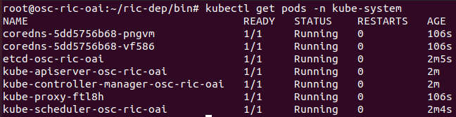

**IMPORTANT**: Before next steps, in the file *../RECIPE_EXAMPLE/example_recipe_oran_j_release.yaml*, change the variables `ricip` and `auxip` from the default value 10.0.0.1 to the IP address of the virtual machine. 

* Install chartmuseum into helm and add ric-common templates:
```sh
./install_common_templates_to_helm.sh
```

* Install and deploy OSC RIC:
```sh
./install -f ../RECIPE_EXAMPLE/example_recipe_oran_j_release.yaml
```

After installation, use the command below to follow the creation of the pods, until they all have the status “Running”:

```sh
watch -n 1 kubectl get pods -n ricplt
```

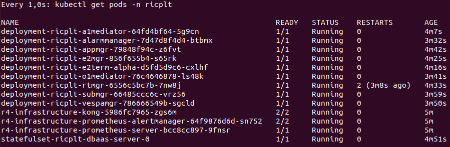

# Modifications to connect OAI gNodeB and OSC RIC
For a successful connection, it is necessary to configure the port used by the E2AP protocol, as well as the OSC RIC's IP address.

First, check which port is used by the e2term-sctp-alpha service:

* Consult running services in the ricplt namespace:
```sh
kubectl get svc -n ricplt
```
 
When running the above command, find the service `service-ricplt-e2term-sctp-alpha` and take note of the port it is using. In the example image below, the port is 36422.

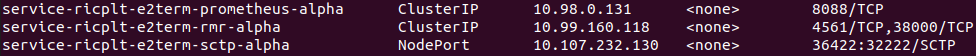

Use this port to modify the `e2ap_server_port` parameter (line 94) of the file `oai/openair2/E2AP/flexric/src/agent/e2_agent_api.c`, as shown in the figure below:


* Next, build the OAI again
```sh
cd oai/cmake_targets/
./build_oai -I -w SIMU --gNB --nrUE --build-e2 --ninja
```

Now you need to check the IP address of the `e2term-alpha` pod. For that, first check the full name of the `e2term-alpha` pod.

* Consult running pods in the ricplt namespace:
```sh
kubectl get pods -n ricplt
```

The command will return a list as in the image below, where in this example the pod's full name is `deployment-ricplt-e2term-alpha-d5fd5d9c6-cxlhf` 


* Then, check the IP address of the `e2term-alpha` pod:
```sh
kubectl describe pod -n ricplt e2term-alpha-pod-name
```
**Note:** Change `e2term-alpha-pod-name` to the pod's full name.

The above command will return several information about the pod, it will be necessary to find the information referring to the IP address as in the image below:

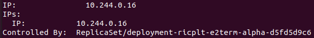

The IP address found will be used in the gNodeB Central Unit (CU) and Distributed Unit (DU) configuration files, in the `near_ric_ip_addr` parameter. For this, add the section below to the end of the configuration files `oai/targets/PROJECTS/GENERIC-NR-5GC/CONF/cu_gnb.conf` and `oai/targets/PROJECTS/GENERIC-NR-5GC/CONF/du_gnb.conf` .

```
e2_agent = {
  near_ric_ip_addr = "10.244.0.16";
  sm_dir = "/usr/local/lib/flexric/"
}
```

# Modifications to connect OAI gNodeB and OAI 5G Core

To correctly connect OAI DU with OAI CU and OAI CU with OAI 5G Core, it is necessary to modify some authentication parameters and also the AMF's IP.

First, configure the `tracking_area_code`, `mcc`, `mnc`, `sst` and `sd` parameters as shown in the image below. You need to make these changes in the CU and DU configuration files (`oai/targets/PROJECTS/GENERIC-NR-5GC/CONF/cu_gnb.conf` and `oai/targets/PROJECTS/GENERIC-NR-5GC/CONF/du_gnb.conf`).

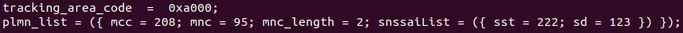

Then, only in the CU configuration file, modify the `amf_ip_address`, `GNB_IPV4_ADDRESS_FOR_NG_AMF` and `GNB_IPV4_ADDRESS_FOR_NGU` parameters according to the IPs shown in the image below.

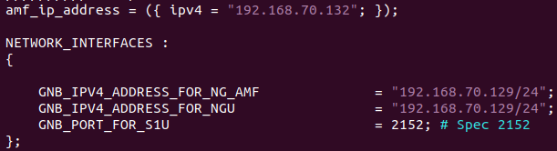


# OAI 5G Core deployment

```sh
cd oai-cn5g-fed/docker-compose
sudo python3 core-network.py --type start-basic --scenario 1
```

# OAI gNodeB deployment

* Go to the OAI build folder:
```sh
cd oai/cmake_targets/ran_build/build
```

* Run OAI gNodeB CU:
```sh
sudo ./nr-softmodem -O ../../../targets/PROJECTS/GENERIC-NR-5GC/CONF/cu_gnb.conf --sa
```

* Run OAI gNodeB DU:
```sh
sudo ./nr-softmodem -O ../../../targets/PROJECTS/GENERIC-NR-5GC/CONF/du_gnb.conf --rfsim --sa -E
```

After running gNodeB CU and DU, you can check the exchange of E2 messages, indicating the setup of the E2 interface between the OAI and the OSC RIC, as shown in the image below.

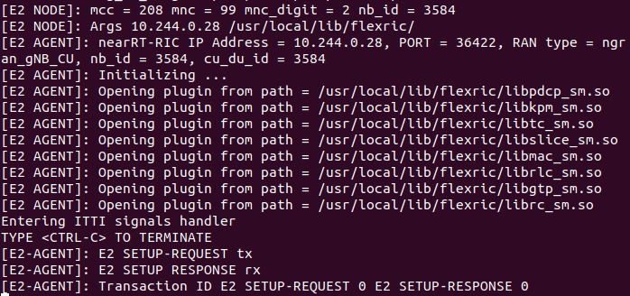

# Check connection in the OSC RIC

In addition to the gNodeB logs, you can check the communication between the gNodeB OAI and the OSC RIC from the logs of the `e2term-alpha` and `e2mgr` pods.

To visualize and follow the logs, run the command below, in one terminal for `e2term-alpha` pod and in another for `e2mgr` pod.

```sh
kubectl logs -n ricplt -f full-name-of-pod
```

* In the images below we can see, via `e2term-alpha` logs, the `New connection request` messages sent by the OAI CU and DU to the `e2term-alpha` pod:

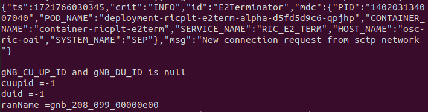


* In addition, via the `e2mgr` logs, we can see that the `E2 setup request` has been received from the OAI CU and DU, as shown in the images below:

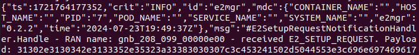
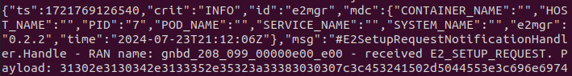

* Furthermore, still in the `e2mgr` logs, we can see the `RanConnectStatusChangeManager` message from the CU and DU, changing from *Disconnected* to *Connected* status, as shown in the figures below:

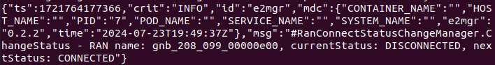
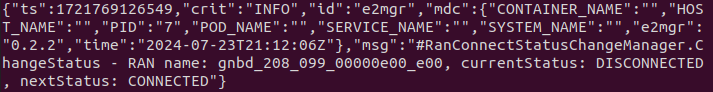
